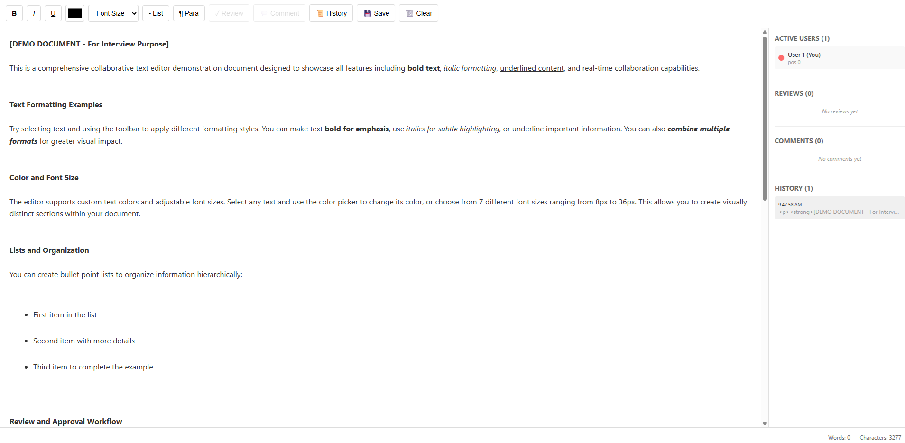
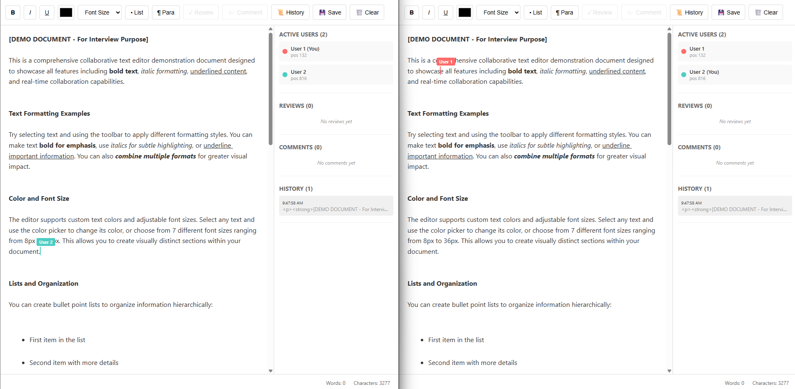
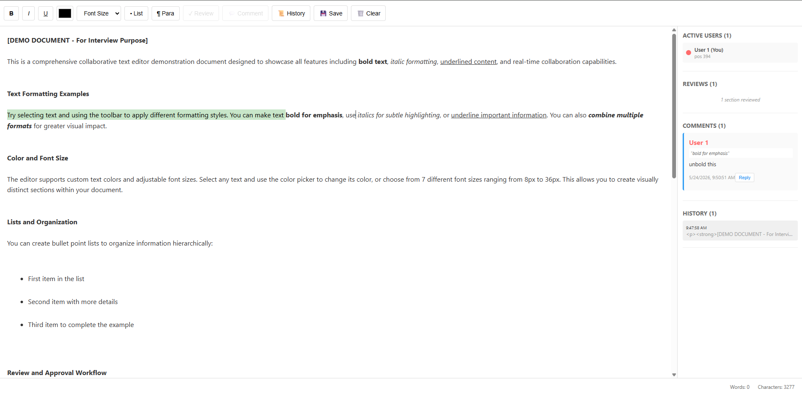
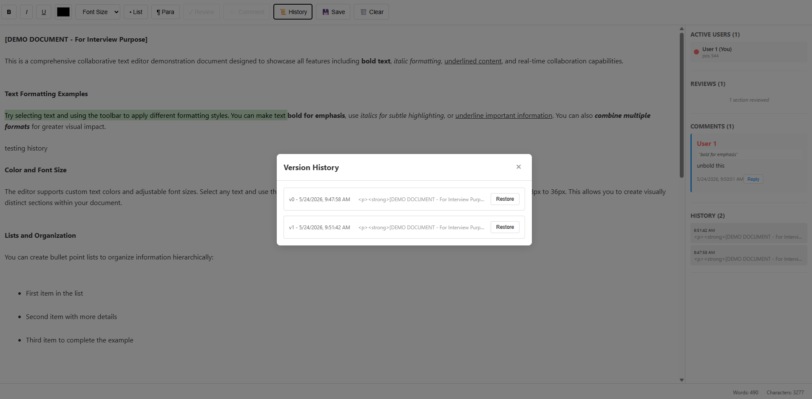

# Collaborative Text Editor

A real-time collaborative text editor with support for multiple users, formatting, reviews, comments, and version history.

## Features

- **Real-time Collaboration**: Multiple users can edit the same document simultaneously
- **Formatting Tools**: Bold, italic, text color, and font size controls
- **User Cursors**: See where other users are currently editing
- **Review Functionality**: Mark text as reviewed with visual highlighting
- **Comments**: Add comments to specific text ranges (like Google Docs)
- **Version History**: Track all changes with timestamps
- **Persistent Storage**: Document state is maintained on the server

## Project Structure

```
.
├── backend/                  # Express + Socket.io server
│   ├── server.js
│   └── package.json
├── frontend/                 # React + Vite client
│   ├── src/
│   │   ├── components/
│   │   │   ├── TextEditor.jsx
│   │   │   └── TextEditor.css
│   │   ├── App.jsx
│   │   ├── main.jsx
│   │   └── index.css
│   ├── index.html
│   ├── vite.config.js
│   ├── eslint.config.js
│   └── package.json
├── package.json              # Root package.json
└── README.md
```

## Quick Start

### Prerequisites

- Node.js (v16 or higher)
- npm

### Installation & Running

1. **Install dependencies:**
   ```bash
   npm run setup
   ```
   This installs dependencies for both backend and frontend.

2. **Start the application:**
   ```bash
   npm run dev
   ```
   Or use the provided batch file on Windows:
   ```bash
   start-dev.bat
   ```
   This starts both backend (port 3000) and frontend (port 5173) concurrently.

3. **Open in browser:**
   Navigate to `http://localhost:5173`

That's it! The backend runs on `http://localhost:3000` and frontend on `http://localhost:5173`.

### Testing Multi-User Collaboration

To test collaborative features:
1. Open `http://localhost:5173` in multiple browser tabs or windows
2. Each tab represents a different user with a unique color
3. Edit text in one tab and see real-time updates in others
4. Try adding comments, marking reviews, and checking cursor positions
5. Open History modal to see version tracking

## Usage

### Formatting
- Select text and use the toolbar buttons to apply formatting:
  - **B**: Make text bold
  - **I**: Make text italic
  - **U**: Make text underline
  - **Color picker**: Change text color
  - **Font Size**: Select from predefined sizes (8px - 36px)
  - **• List**: Create bullet points
  - **¶ Para**: Format as paragraph

### Reviews
- Select text and click **✓ Review** to mark it as reviewed
- Reviewed text is highlighted in green
- Other users can see which text has been reviewed
- Click again to unmark as reviewed

### Comments
- Select text and click **💬 Comment** to add a comment
- Comments appear in the sidebar with:
  - Author name and color
  - Timestamp
  - The text being commented on
- Reply to comments to create discussion threads
- All users see comments in real-time

### History
- Click **📜 History** to view version history
- The sidebar shows recent changes with timestamps
- Each change is tracked with the user who made it
- Restore previous versions by selecting from history

### Active Users
- The sidebar displays active users and their current cursor positions
- See in real-time where other collaborators are working
- Each user has a unique color for easy identification

### Word Count & Save
- Word count updates in real-time as you type (shown in footer)
- Click **💾 Save** to save document to browser's local storage
- Saved data includes content, timestamp, and word count

## Screenshots

### 1. Main Editor Interface
The primary editing interface with toolbar and sidebar showing active users.



**Features visible:**
- Formatting toolbar (Bold, Italic, Underline, Color, Font Size, Lists, Paragraphs)
- Review and Comment buttons
- History and Save buttons
- Word count in footer
- Sidebar with active users list

### 2. Real-Time Collaboration
Multiple users editing simultaneously with visible cursor positions.



**Features visible:**
- Remote cursor positions with user names and colors
- Real-time content synchronization
- Active users count in sidebar
- Each user's cursor position displayed

### 3. Comments & Reviews
Demonstrating the commenting system and review highlighting.



**Features visible:**
- Green highlighted text (marked as reviewed)
- Comment threads in sidebar with:
  - Author name and color badge
  - Comment text
  - Timestamp
  - Reply button and reply threads
- Multiple comments from different users

### 4. Version History & Restoration
History modal showing document version tracking.



**Features visible:**
- Version history list with timestamps
- Content preview for each version
- Restore button to revert to previous versions
- User information for each change
- Chronological ordering of changes

## Architecture

### Backend (Express + Socket.io)
- `backend/server.js`: Handles real-time communication and document state management
- Manages document content, formatting, reviews, comments, and history
- Broadcasts changes to all connected clients

### Frontend (React + Vite)
- `frontend/src/components/TextEditor.jsx`: Main editor component
- `frontend/src/components/TextEditor.css`: Styling
- Socket.io client for real-time updates

## Version Control Strategy for Multi-User Editing

### Implementation: Simple Version Number Approach

The application uses a **simple integer-based version counter** for multi-user conflict detection:

```javascript
// Each edit includes a baseVersion
socketRef.current.emit('edit', { 
  content: newContent,
  baseVersion: versionRef.current
});

// Server validates: if baseVersion matches current version, accept edit
// If mismatch detected, reject and sync client to latest version
```

### How It Works

1. **Version Tracking:** Each document maintains a single version counter (incremented on every accepted edit)
2. **Conflict Detection:** When a user submits an edit, they include the version they based it on
3. **Conflict Resolution:** 
   - If versions match → Edit accepted, version incremented
   - If versions don't match → Edit rejected, client synced to latest version
4. **Client Sync:** On conflict, client receives the current document state and version

### Tradeoffs

| Aspect | Simple Version | Operational Transformation (OT) | CRDT |
|--------|---|---|---|
| **Complexity** | ⭐ Very Simple | ⭐⭐⭐⭐ Complex | ⭐⭐⭐ Moderate |
| **Concurrent Edits** | ❌ Rejects conflicts | ✅ Merges automatically | ✅ Merges automatically |
| **Implementation** | ~50 lines | ~500+ lines | ~300+ lines |
| **Latency Handling** | Requires resync | Handles gracefully | Handles gracefully |
| **Demo Suitability** | ✅ Perfect | ⚠️ Overkill | ⚠️ Overkill |
| **Production Ready** | ❌ No | ✅ Yes | ✅ Yes |

### Why Simple Version for This Demo

**Chosen for:**
1. **Clarity** - Easy to understand and explain in an interview
2. **Quick Implementation** - Focus on feature completeness rather than conflict resolution complexity
3. **Demo Scenarios** - In typical demo usage, simultaneous conflicting edits are rare
4. **Maintainability** - Minimal code, easy to debug and modify
5. **Learning Value** - Demonstrates understanding of version control concepts without over-engineering

**Trade-off Accepted:**
- Users editing the same section simultaneously will see a "conflict detected" message and their edit will be rejected
- They'll need to reapply their changes after the document syncs
- This is acceptable for a demo but not for production

### Production Considerations

For a production system, you would implement:
- **Operational Transformation (OT)** - Google Docs approach
- **CRDT (Conflict-free Replicated Data Type)** - Figma/Notion approach
- Both allow concurrent edits to merge intelligently without conflicts

### Code References

- **Version tracking:** `backend/server.js` (lines 40-41, 95-96)
- **Conflict detection:** `backend/handlers/documentHandler.js`
- **Client-side version:** `frontend/src/hooks/useEditor.js` (versionRef)

## Development

### Build for Production

```bash
npm run build
```

### Lint Code

```bash
npm run lint --prefix frontend
```

## Notes

- Documents are stored in memory on the server and will be reset when the server restarts
- For production use, consider adding a database for persistent storage
- The application uses a single default document (`default-doc`) for simplicity
- **Conflict Handling:** If two users edit simultaneously at the same location, the second edit will be rejected and the user will see a "conflict detected" message. They can reapply their changes after the document syncs to the latest version. This is a deliberate tradeoff for simplicity in the demo (see "Version Control Strategy" section above).
